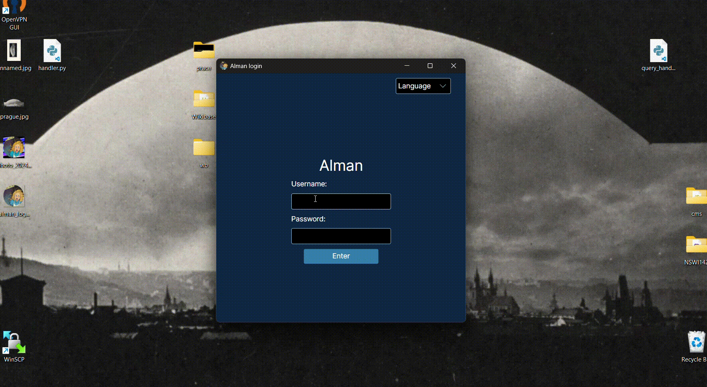
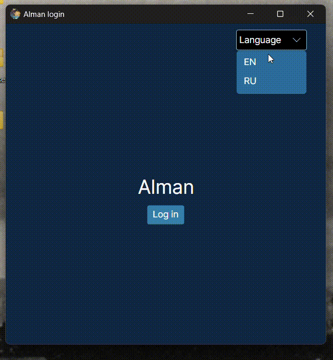
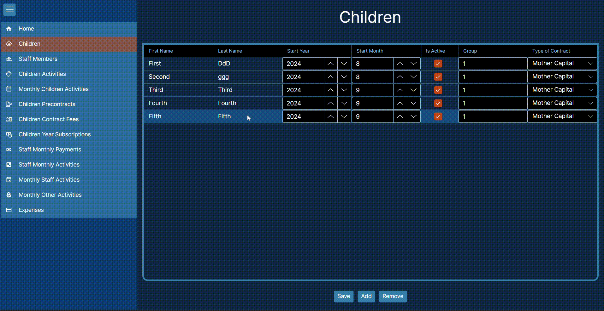
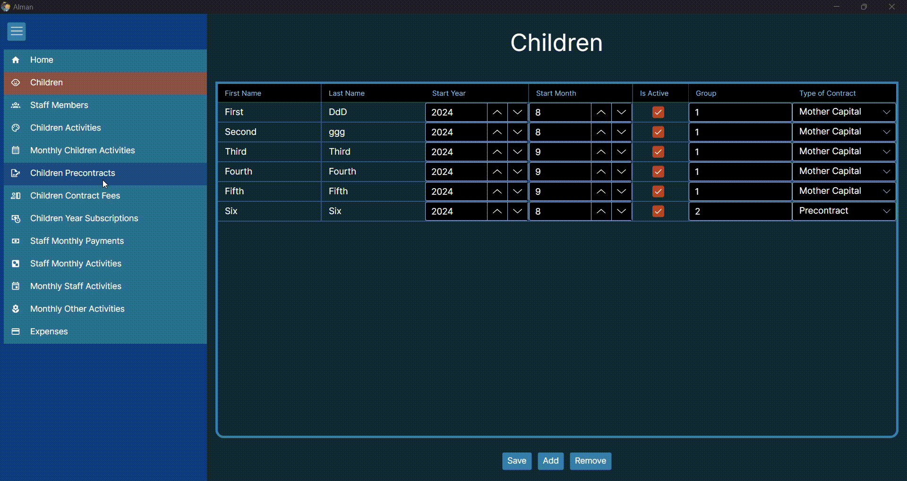
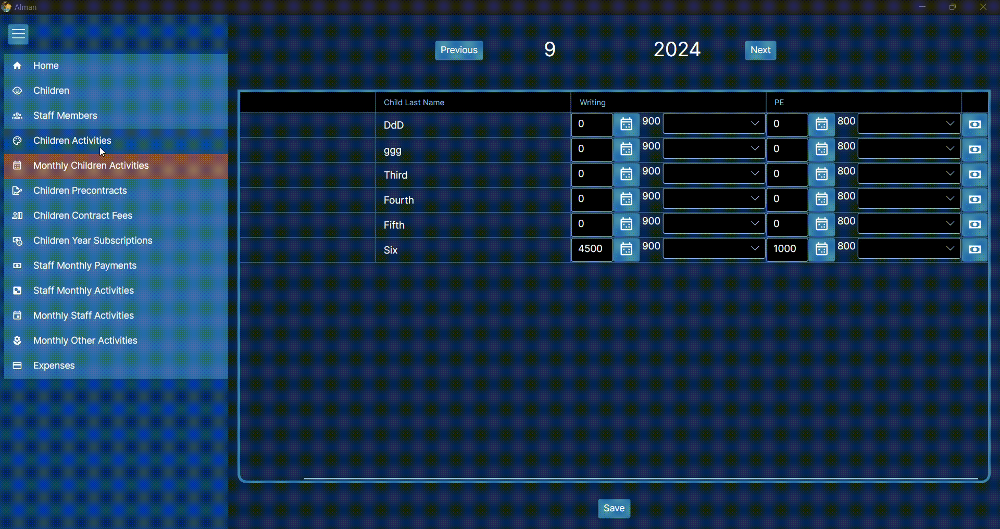
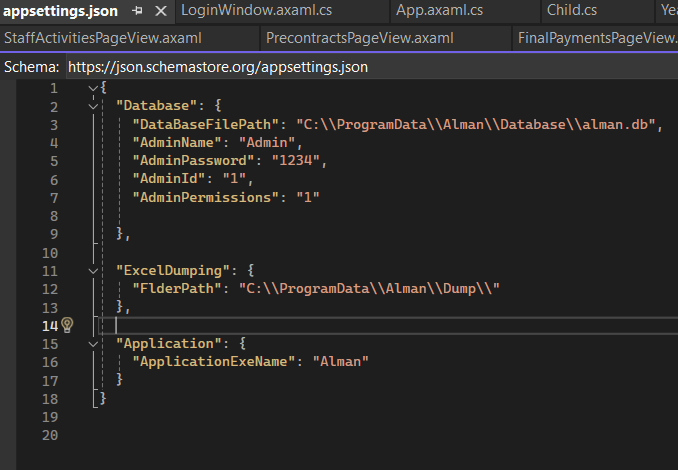
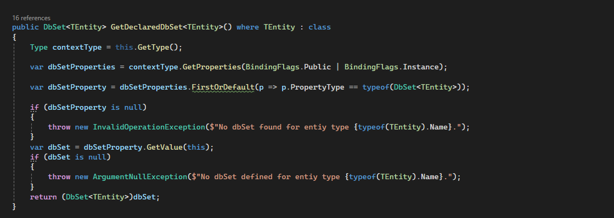

## ALMAN
Alman is information system for kindergarten. Developed mainly for the administrator as it serves as complex calculator for all expenses and revenue of the kindegarten. The application was developed to substitute Excel tables where it used to be calculated.

## Overview
- [ALMAN](#alman)
- [Overview](#overview)
- [Used technologies](#used-technologies)
- [Used technoloies in context of C# language](#used-technoloies-in-context-of-c-language)
- [Architecture](#architecture)
- [Problems and challenges during the development](#problems-and-challenges-during-the-development)
  - [Database level](#database-level)
  - [UI level](#ui-level)
- [Demo](#demo)
  - [Login process.](#login-process)
  - [Choosing language](#choosing-language)
  - [Adding new child](#adding-new-child)
  - [Saving Monthly activities](#saving-monthly-activities)
  - [Showing bill for the child](#showing-bill-for-the-child)
- [What was achieved](#what-was-achieved)
- [What wasnt achieved and why](#what-wasnt-achieved-and-why)
- [Interesting parts of code](#interesting-parts-of-code)
- [Future ideas](#future-ideas)
- [References to used resources](#references-to-used-resources)

## Used technologies
Application is a desktop application, that works with database. Database system that was used is **SQLite**. The system was chosen, because the data model is not complex and the application is primarily for one person, therefore there is no need for complex concurrency mechanisms. **Entity Framework** was used to work with database. For UI **Avalonia** framework was chosen. The framework was chosen because it allows development of multiplatform applications. Application can run on Windows and MacOS. Concept of **Resources** was used to add localization to the application.
**Confguration packages** were used to define general configuration of the application. Package **NPOI** was used to dump the database as readable excel file, if something happens.

## Used technoloies in context of C# language
- Extension methods (not as much as it was desired)
- Lambda functions (Mainly in UI to create controls)
- Reflection (Mainly in Database layer, to create generic API)
- Little bit of asynchronous programming (Mainly in UI layer to manage windows)


## Architecture

Application is divided into several levels. From lowest to highest: 
- Database level: file that stores the whole database of the application.
- Database communication: API using Entity framework to communicate with database, Data model
- Business level: mainly intermediate level that encapsulates the API from database communication
- UI:
  - Control level: level that gets all data from business level, conducts all calculations, send changes to the business level.
  - Model level: Data model that is used in UI (mainly duplicates Data model from Database level, but doesnt have all rudundant in UI context functions from Database level data model)
  - ViewModel level: intermediate level between view and model. Takes care of getting data for the view. Partially reacts to user inputs.
  - View level: takes care for showing the UI controls. Partially reacts to user input.


## Problems and challenges during the development
### Database level
1. During the development I found out that Entity framework is extremely useful and comfortable to work with. It creates the entities in the way that if there is a relation between entities it will be reflected in both of the entities. For example every child has precontract. In data model it would look like
```csharp
class Child
{
    // ... other child properties
    public virtual ICollection<Precontract> Precontracts { get; set; } = new List<Precontract>();
    // ... other child properties

}

class Precontract
{
    // ... other precontract properties
    public virtual Child Pchild { get; set; } = null!;
    // .. other precontract properties
}
```

And if I create new child, I can do it:
```csharp
var child = new Child {Id = 1, Name = "Name", Precontracts = [new Precontract{Sum = 6000}]}
```
But if I want to read child with id 1 from database, I would get the instance of class Child, but property Precontracts will be empty. Therefore I needed to get dependable entities separetely.

2. Another interesting moment I was stuck on was developing generic API for any entity. First I developed more or less the same API for every entity separetely (which was tedious), but it looked almost the same and I could not come up with generic way, because functions were calling different DbSets, named differently. For example `DbSet<Child> Children` or ` Dbset<Activity> Activities`. That was the moment where reflection helped and it was possible to reduce copy-pasted code.

### UI level
1. The main challenge here was to understand how to define and connect UI controls to each other. Avalonia framework has poor documentation and very few cose samples. Good help here was ChatGPT. When I was stuck on something I would ask ChatGpt to generate a sample of how to define control element or how to connect it to other control element, it would generate code (that could not be built in some cases) and from there it was easier to get the general idea.

2. Another thing that was a bit of a challenge is dumping database as readable Excel file. If something happens with the application administrator will at least have the backup data. NPOI package was chosen to dump data. As of now it is not ideal as the names of the columns should preferably be in localized as well and they are not for now.

3. Tricky thing was to create some common styles for similar data grids and buttons as again there was not direct guidelines how to do it. But some common style files were created in the end.

4. Difficult thing to implement was login window. I wanted to introduce at least basic security element, therefore login process was introduced. It was not requested, but for future use it might be useful. Turned out any window in Avalonia must have parent window to which its bound. Thus if we do not have visible, active parent window we cannot show login window (as show dialog). In the end it was achieved by athynchronous waiting for the login button to be clicked.

## Demo
Here are demos of some interesting (and sometimes challenging) functionality.
### Login process.


### Choosing language
For now there is a need in only 2 languages: Russian and English.


### Adding new child


### Saving Monthly activities


### Showing bill for the child


## What was achieved
1. Among main aims was to create "complex" calculator for the administrator that would calculate result sum needed to be paid by child and would create readable view of the result "bill". That was achieved as is shown in the demo.

2. Another crutial aspect I wanted to implement was localization. Turned out it was the easiest part of the development.

3. Another thing that was achieved is login window as at least basic security was desired.

4. The last critical part is (exe and multiplatform instances of the application.)

## What wasnt achieved and why

1. There is no Web API Server and there is no network communication. In the beginning of the project one of the possible implementations included Network layer between business level and UI (Control level). It was expected that on the "server" side the web API server will run and process requests that it recieves via network. In the process of the development it was found out that it was redundant, as the whole application would run on one computer and there is no need for (vzdaleny pristup).

2. Another thing I wanted to experiment more with is styles and themes in Avalonia framework. The only themes I found are Fluent and Simple, The only styles I found were connected to colour pallette of the UI controls. I could not find anything more on the internet, therefore I came to conclusion that there is probably no such thing at all.

## Interesting parts of code
It was really interesting to work with Entity framework. Confusing part was that I did not know how entity framework was connected to transactions and if it was connected to them at all. I could not find anything on that on official Microsoft web pages, but on different forums I read that Entity framework is trying to simulate transactions and if we try to use transactions and Entity framework together ot would defeat the purpose of using Entity framework. I liked that I could define the whole structure in code and It would create the `.db` file.

Another interestin thing was to work with configuration files. I have never done that before and I wanted to add the application configuartion for further packaging.



At first I was really against working with Refllection, as it is slow. But in the end I decided for it as I wanted to get rid of the copy-pasting. That is the function that made it possible to create generic API.



I do not know how much slower it makes the application, but as I didnt notice it while running it, I guess it is tolerable.

## Future ideas
- How to lock alam.db file for read only if not from app.
- May be rollback of save.

## References to used resources
1. Logo icon was found on Pinterest. The link is https://pin.it/6OnUYhahT.